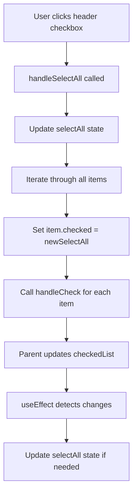

# Select All Feature Documentation

## Overview

The Select All feature allows users to select or deselect all items in the drag-and-drop component by clicking a single checkbox in the header. This feature is implemented in the Recipe List Modal's Step Components and provides a convenient way to manage bulk selections.

## Features

- ✅ **Select All**: Click header checkbox to select all items
- ✅ **Deselect All**: Click header checkbox to deselect all items  
- ✅ **Auto-sync**: Header checkbox automatically reflects the state of all items
- ✅ **Individual Control**: Individual item checkboxes continue to work independently
- ✅ **Visual Feedback**: Clear visual indication of selection state

## Architecture

### Component Structure

```
DragDrop (Parent)
├── StepCard
│   ├── CardHeader (contains select all checkbox)
│   └── ScrollView
│       └── DragingEl (contains individual item checkboxes)
```

### State Management

The select all functionality uses a **lifted state pattern** where the selection state is managed in the parent component (`StepCard`) and passed down to child components.

## Implementation Details

### 1. StepCard Component (`src/views/Recipe/List/Modal/StepComponents/Card.tsx`)

#### State Variables
```typescript
const [selectAll, setSelectAll] = useState(false);
```

#### Select All Handler
```typescript
const handleSelectAll = () => {
  const newSelectAll = !selectAll;
  setSelectAll(newSelectAll);
  
  const allItems = items.flatMap((row: any) => row.rows || []);
  
  allItems.forEach((item: any) => {
    item.checked = newSelectAll;
    handleCheck(item);
  });
};
```

#### Auto-sync Effect
```typescript
useEffect(() => {
  if (!deleteStep) return;
  
  const allItems = items.flatMap((row: any) => row.rows || []);
  
  if (allItems.length === 0) {
    setSelectAll(false);
    return;
  }
  
  const allChecked = allItems.every((item: any) => item.checked === true);
  setSelectAll(allChecked);
}, [items, deleteStep, checkedList]);
```

### 2. CardHeader Component (`src/views/Recipe/List/Modal/StepComponents/CardHeader.tsx`)

#### Props Interface
```typescript
interface Props {
  headerScrollRef: any;
  headColumns: any;
  deleteStep: boolean;
  selectAll?: boolean;
  onSelectAll?: () => void;
}
```

#### Select All Checkbox
```typescript
{deleteStep && (
  <div
    onClick={() => {
      onSelectAll();
    }}
    className={`w-[18px] mr-2 h-[18px] border border-[var(--main)] rounded-[4px] ml-3 hover:cursor-pointer flex items-center justify-center ${
      selectAll ? "bg-[var(--main)]" : ""
    }`}
  >
    <div className="w-[18px]">
      {selectAll && <CheckLine fill="white" />}
    </div>
  </div>
)}
```

### 3. DragingEl Component (`src/views/Recipe/List/Modal/StepComponents/DragingEl.tsx`)

Individual item checkboxes remain unchanged and continue to work with the existing `handleCheck` function:

```typescript
{deleteStep && (
  <div
    onClick={() => {
      item.checked = !item?.checked;
      handleCheck(item);
    }}
    className={`w-[18px] mr-2 h-[18px] border border-[var(--main)] rounded-[4px] ml-2 hover:cursor-pointer flex items-center justify-center ${
      item.checked ? "bg-[var(--main)]" : ""
    }`}
  >
    <div className="w-[18px]">
      {item.checked && <CheckLine fill="white" />}
    </div>
  </div>
)}
```

## Usage

### Enabling Select All Mode

1. Navigate to the Recipe List Modal
2. Click the "Select" button in the header to enable delete mode
3. The select all checkbox will appear in the table header

### Using Select All

1. **Select All Items**: Click the checkbox in the header to select all items
2. **Deselect All Items**: Click the checkbox again to deselect all items
3. **Individual Selection**: Use individual checkboxes to select specific items
4. **Mixed State**: When some items are selected, the header checkbox shows an intermediate state

### Visual States

| State | Header Checkbox | Description |
|-------|----------------|-------------|
| All Selected | ✅ Checked | All items are selected |
| None Selected | ⬜ Unchecked | No items are selected |
| Mixed Selection | ⬜ Unchecked | Some items are selected |

## Data Flow



## API Reference

### StepCard Props

| Prop | Type | Description |
|------|------|-------------|
| `checkedList` | `any[]` | Array of selected item IDs |
| `handleCheck` | `(val: any) => void` | Function to handle individual item selection |

### CardHeader Props

| Prop | Type | Default | Description |
|------|------|---------|-------------|
| `selectAll` | `boolean` | `false` | Whether all items are selected |
| `onSelectAll` | `() => void` | `() => {}` | Function to handle select all toggle |
| `deleteStep` | `boolean` | `false` | Whether delete mode is active |

## Performance Considerations

- **Efficient Updates**: The `useEffect` only runs when necessary dependencies change
- **Minimal Re-renders**: State updates are batched to prevent unnecessary re-renders
- **Memory Efficient**: No additional data structures are created for tracking selections

## Browser Compatibility

- ✅ Chrome 90+
- ✅ Firefox 88+
- ✅ Safari 14+
- ✅ Edge 90+

## Testing

### Manual Testing Checklist

- [ ] Header checkbox appears when delete mode is enabled
- [ ] Clicking header checkbox selects all items
- [ ] Clicking header checkbox again deselects all items
- [ ] Individual item checkboxes work independently
- [ ] Header checkbox updates when individual items are selected/deselected
- [ ] Header checkbox shows correct state when some items are selected
- [ ] Feature works with empty item lists
- [ ] Feature works with large item lists (performance test)

### Unit Tests

```typescript
describe('Select All Feature', () => {
  it('should select all items when header checkbox is clicked', () => {
    // Test implementation
  });
  
  it('should deselect all items when header checkbox is clicked again', () => {
    // Test implementation
  });
  
  it('should update header checkbox when individual items are selected', () => {
    // Test implementation
  });
});
```

## Troubleshooting

### Common Issues

1. **Header checkbox not appearing**
   - Ensure `deleteStep` is set to `true`
   - Check that the component is properly mounted

2. **Select all not working**
   - Verify `handleCheck` function is properly passed down
   - Check that items have the correct structure with `checked` property

3. **Header checkbox state not syncing**
   - Ensure `useEffect` dependencies are correct
   - Check that `items` array is properly updated

### Debug Mode

Add console logs for debugging:

```typescript
const handleSelectAll = () => {
  console.log('Select all clicked, current state:', selectAll);
  // ... rest of implementation
};

useEffect(() => {
  console.log('Items changed, checking select all state');
  // ... rest of implementation
}, [items, deleteStep, checkedList]);
```

## Future Enhancements

### Potential Improvements

1. **Indeterminate State**: Show intermediate state when some items are selected
2. **Keyboard Shortcuts**: Add keyboard shortcuts for select all (Ctrl+A)
3. **Bulk Actions**: Add bulk action buttons when items are selected
4. **Selection Persistence**: Persist selection state across component re-renders
5. **Custom Selection Logic**: Allow custom selection rules

### Example: Indeterminate State

```typescript
const isIndeterminate = someItemsSelected && !allItemsSelected;

// In JSX
<input 
  type="checkbox"
  checked={selectAll}
  ref={(el) => {
    if (el) el.indeterminate = isIndeterminate;
  }}
  onChange={handleSelectAll}
/>
```

## Contributing

When contributing to this feature:

1. Follow the existing code style and patterns
2. Add appropriate TypeScript types
3. Update this documentation for any changes
4. Add unit tests for new functionality
5. Test across different browsers and screen sizes

## Related Files

- `src/views/Recipe/List/Modal/StepComponents/Card.tsx` - Main implementation
- `src/views/Recipe/List/Modal/StepComponents/CardHeader.tsx` - Header component
- `src/views/Recipe/List/Modal/StepComponents/DragingEl.tsx` - Individual items
- `src/views/Recipe/List/Modal/StepComponents/DragDrop.tsx` - Parent component

---

*Last updated: December 2024* 